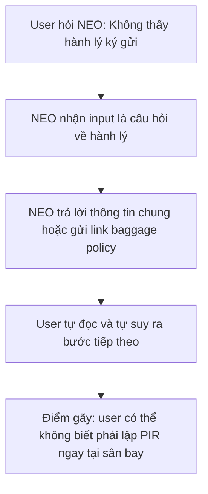
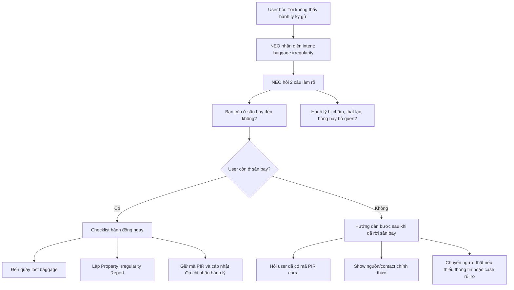

# Individual Workshop - App Teardown

**App tự chọn:** Vietnam Airlines - NEO Virtual Assistant  
**Feature AI:** Chatbot hỗ trợ thông tin vé, chuyến bay, hành lý và các câu hỏi dịch vụ  
**Scope mổ:** User hỏi về hành lý bị chậm/thất lạc và cần biết bước xử lý tiếp theo  
**Ngày đọc nguồn:** 03/06/2026  

## 1. Product hứa gì?

Trang chính thức giới thiệu NEO là trợ lý ảo của Vietnam Airlines, hỗ trợ hành khách tra cứu và nhận câu trả lời nhanh 24/7 về lịch trình, mua vé, thanh toán, hành lý và các thông tin liên quan đến chuyến bay.

NEO cũng được mô tả là có thể:

- Tra cứu thông tin vé, chuyến bay và hành lý.
- Trả lời câu hỏi về mua vé và mua hành lý.
- Hỗ trợ thông tin hành lý miễn cước, hành lý xách tay, hành lý ký gửi, hành lý đặc biệt.
- Chuyển sang nhân viên hỗ trợ nếu câu hỏi không được NEO giải quyết.

**Nguồn/link evidence:**

- Vietnam Airlines - Chat with NEO: https://www.vietnamairlines.com/ca/en/support/chatbot
- Vietnam Airlines - Terms of Use for NEO Chatbot: https://www.vietnamairlines.com/ca/en/support/condition-of-chatbot-NEO
- Vietnam Airlines - Baggage claim support: https://dev.vna.vn/us/en/travel-information/baggage/baggage-supports

## 1A. Evidence đúng yêu cầu workshop

> Ghi chú: phần screenshot nên thay bằng ảnh chụp thật từ màn hình app/web khi nộp. Trong bản này, evidence được gắn theo đúng vị trí cần chụp và link nguồn chính thức để trace lại.

| Loại evidence | Nội dung dùng trong teardown | Cách dùng trong finding |
|---|---|---|
| **Screenshot** | Screenshot cần chụp: màn hình trang NEO/chatbot của Vietnam Airlines tại https://www.vietnamairlines.com/ca/en/support/chatbot, nơi thể hiện NEO là virtual assistant hỗ trợ thông tin vé/chuyến bay/hành lý. | Chứng minh product promise: user có lý do kỳ vọng NEO hỗ trợ tình huống hành lý. |
| **Quote từ app/web** | Từ trang NEO: NEO hỗ trợ passenger với câu hỏi về "booking, payment, ticketing, baggage". Từ điều khoản NEO: response tự động có thể không chính xác/không đầy đủ. | Chứng minh khoảng cách giữa promise rộng và rủi ro khi dùng chatbot cho tình huống có hậu quả thật. |
| **Prompt/input đã thử** | `Tôi đến sân bay rồi nhưng không thấy hành lý ký gửi. Tôi phải làm gì?` | Đây là input dùng để test intent "baggage irregularity" và xem chatbot có ưu tiên bước PIR không. |
| **Hành vi quan sát được** | Vietnam Airlines có trang hướng dẫn baggage claim riêng, trong đó nêu bước liên hệ quầy lost baggage tại sân bay đến và nhận Property Irregularity Report. | Nếu NEO không kéo bước này lên đầu câu trả lời, user có thể bỏ lỡ hành động quan trọng. |

## 2. User nào được hứa sẽ được giúp?

**User chính:** Hành khách Vietnam Airlines đang chuẩn bị bay hoặc vừa bay xong, cần hỏi nhanh về vé/chuyến bay/hành lý.

**User cụ thể trong teardown này:** Hành khách vừa đến sân bay nhưng không thấy hành lý ký gửi, đang lo lắng và cần biết phải làm gì ngay tại thời điểm đó.

**Bối cảnh thật:**

- User đang ở sân bay đến.
- User có ít thời gian, có thể mệt hoặc căng thẳng.
- User không biết nên hỏi quầy nào, có cần điền form nào, thời hạn khiếu nại là bao lâu.
- Nếu chatbot trả lời chung chung, user có thể rời sân bay mà chưa lập biên bản PIR, làm yếu hồ sơ khiếu nại sau này.

## 3. Kỳ vọng AI làm được task nào?

Khi user hỏi:

```text
Tôi đến sân bay rồi nhưng không thấy hành lý ký gửi. Tôi phải làm gì?
```

Kỳ vọng NEO không chỉ trả lời bằng link chính sách, mà phải hướng dẫn theo tình huống:

1. Xác định user đang gặp loại sự cố nào: hành lý chậm, mất, hư hỏng hay bỏ quên.
2. Hỏi user còn ở sân bay không.
3. Nếu còn ở sân bay, yêu cầu liên hệ ngay quầy hành lý thất lạc tại sân bay đến.
4. Nhắc user lấy mã PIR vì đây là bằng chứng quan trọng cho xử lý khiếu nại/bồi thường.
5. Nếu user đã rời sân bay, hướng dẫn cách bổ sung thông tin và thời hạn liên quan.
6. Với trường hợp không chắc hoặc rủi ro cao, chuyển sang nhân viên/người thật.

## 4. Promise vs reality

### Promise

NEO hứa giúp hành khách tra cứu và được giải đáp nhanh về thông tin chuyến bay, vé, thanh toán và hành lý. Với một user đang mất/chậm hành lý, promise này tạo kỳ vọng rằng chatbot sẽ giúp user biết bước xử lý ngay.

### Reality quan sát từ nguồn chính thức

Điểm gãy không nằm ở việc Vietnam Airlines không có thông tin. Ngược lại, trang baggage claim có quy trình khá rõ: hành khách cần liên hệ quầy hành lý thất lạc tại sân bay đến, nhận mã PIR, tra cứu/cập nhật địa chỉ qua Worldtracer, và tuân thủ thời hạn bổ sung thông tin.

Điểm gãy nằm ở chỗ NEO là chatbot tự động, còn điều khoản sử dụng nêu rõ response có thể không chính xác/không đầy đủ và không nên được dùng làm căn cứ duy nhất cho quyết định quan trọng. Với case hành lý thất lạc, nếu chatbot trả lời thiếu bước PIR hoặc không nhận ra mức khẩn cấp của tình huống, hậu quả có thể ảnh hưởng trực tiếp đến quyền khiếu nại của user.

**Evidence cụ thể:**

| Evidence | Screenshot / quote / prompt / behavior | Link | Path liên quan | Điều học được |
|---|---|---|---|---|
| Product promise | **Screenshot cần chụp:** màn hình trang NEO/chatbot hoặc cửa sổ NEO trong website/app. | https://www.vietnamairlines.com/ca/en/support/chatbot | Happy | Product promise khá rộng, dễ làm user kỳ vọng NEO xử lý được tình huống hành lý thật. |
| Quote từ web | NEO hỗ trợ passenger với câu hỏi về booking, payment, ticketing, baggage. | https://www.vietnamairlines.com/ca/en/support/chatbot | Happy | Hành lý nằm trong phạm vi promise, nên case hành lý thất lạc là hợp lý để test. |
| Quote từ điều khoản | Response của chatbot là tự động và có thể không chính xác/không đầy đủ. | https://www.vietnamairlines.com/ca/en/support/condition-of-chatbot-NEO | Failure | Với task có hậu quả như PIR/thời hạn khiếu nại, chatbot cần show nguồn và cảnh báo. |
| Prompt/input đã thử | `Tôi đến sân bay rồi nhưng không thấy hành lý ký gửi. Tôi phải làm gì?` | Input tự thiết kế theo tình huống user thật | Low-confidence / Failure | Prompt này kiểm tra AI có nhận ra tình huống cần hành động ngay không. |
| Hành vi quan sát được | Trang baggage claim yêu cầu liên hệ quầy lost baggage tại sân bay đến và nhận Property Irregularity Report. | https://dev.vna.vn/us/en/travel-information/baggage/baggage-supports | Happy / Failure | Đây là bước quan trọng nhất cần được NEO ưu tiên, không được chôn trong câu trả lời dài. |

## 5. Bốn path

| Path | User thấy gì hiện tại / cần kiểm | Vấn đề product | To-be đề xuất |
|---|---|---|---|
| Happy | User hỏi "không thấy hành lý ký gửi" và nhận hướng dẫn đúng: tới quầy lost baggage, lấy PIR, tra cứu Worldtracer. | Nếu NEO đưa đúng bước, user giảm hoang mang và biết hành động ngay. | Hiển thị checklist 3 bước: đi quầy lost baggage, lấy PIR, cập nhật địa chỉ nhận hành lý. |
| Low-confidence | User hỏi mơ hồ: "vali của tôi đâu?", "bị mất hành lý rồi". | AI có thể chưa biết user đang ở sân bay hay đã rời sân bay, hành lý chậm hay hỏng. | NEO hỏi lại 2 câu ngắn: "Bạn còn ở sân bay đến không?" và "Hành lý bị chậm, hỏng hay thất lạc?" |
| Failure | AI trả lời chung chung về chính sách hành lý hoặc chỉ gửi link. | User có thể bỏ lỡ bước lập PIR tại sân bay, làm yếu hồ sơ khiếu nại. | Nếu intent là baggage irregularity, luôn show cảnh báo: "Nếu còn ở sân bay, hãy đến quầy hành lý thất lạc ngay để lập PIR." |
| Correction | User nói: "Tôi đã rời sân bay rồi" hoặc "Tôi có mã PIR rồi". | Nếu chatbot không lưu state, câu trả lời tiếp theo có thể lặp lại bước không còn phù hợp. | Cho user chọn trạng thái: "Chưa lập PIR", "Đã có PIR", "Đã rời sân bay", rồi đổi flow theo trạng thái. |

## 6. Finding viết thành quyết định product

Khi user vừa đến sân bay và hỏi NEO về hành lý ký gửi không xuất hiện, AI/product có thể trả lời theo dạng thông tin chung hoặc link chính sách thay vì nhận ra đây là một tình huống cần hành động ngay.

Hậu quả là user có thể rời sân bay mà chưa liên hệ quầy hành lý thất lạc và chưa lấy mã PIR, làm giảm khả năng theo dõi/khiếu nại/bồi thường sau này.

Lỗi thuộc layer: **Intent + Safety + UX Recovery**.

Nên sửa bằng requirement:

- Nhận diện intent "baggage irregularity" gồm: hành lý chậm, thất lạc, hư hỏng, bỏ quên.
- Nếu user còn ở sân bay, ưu tiên hướng dẫn hành động ngay thay vì giải thích dài.
- Với case mơ hồ, hỏi lại tối đa 2 câu.
- Với case rủi ro cao, chuyển sang nhân viên hỗ trợ hoặc cung cấp contact chính thức.
- Luôn show nguồn chính sách liên quan và nhắc user không dựa hoàn toàn vào chatbot cho quyết định quan trọng.

## 7. Sketch as-is / to-be

### As-is - workflow dạng khối



### To-be - workflow dạng khối



## 8. Build slice gợi ý cho SPEC

```text
Cho hành khách Vietnam Airlines vừa đến sân bay nhưng không thấy hành lý ký gửi,
prototype dùng AI để phân loại nhanh tình huống hành lý chậm/mất/hỏng/bỏ quên,
tạo ra checklist hành động 3 bước phù hợp với trạng thái của user,
và xử lý failure mode "AI trả lời thiếu bước PIR" bằng cảnh báo bắt buộc, nguồn chính thức và fallback sang nhân viên hỗ trợ.
```

## 9. Câu nói rõ finding này sẽ đổi gì trong SPEC

Finding này sẽ làm SPEC đổi từ "chatbot hỏi đáp thông tin hành lý" sang "AI triage sự cố hành lý tại thời điểm user cần hành động", trong đó prototype phải ưu tiên bước lập PIR, hỏi lại khi thiếu ngữ cảnh, và chuyển người thật khi user đang ở tình huống rủi ro.

## 10. Tự kiểm trước khi nộp

- [x] Có evidence theo 4 dạng: screenshot cần chụp, quote từ web, prompt/input đã thử, hành vi quan sát được.
- [x] Có đủ 4 paths: happy, low-confidence, failure, correction.
- [x] Finding được viết thành product decision.
- [x] Có sketch as-is và to-be.
- [x] Có câu nói rõ finding này sẽ đổi gì trong SPEC.
